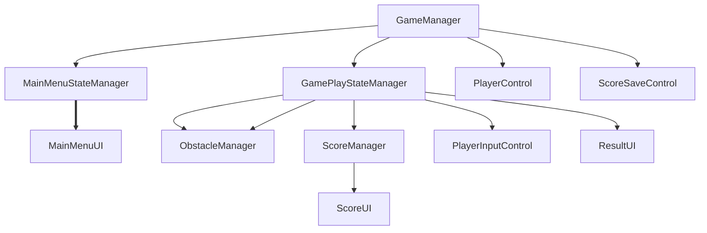

## Technical decisions
## Core Structure

```mermaid
graph TD;
    GameManager-->MainMenuStateManager
    MainMenuStateManager ==> MainMenuUI
    GameManager-->GamePlayStateManager
    GameManager-->PlayerControl
    GameManager-->ScoreSaveControl
    GamePlayStateManager-->ObstacleManager
    GamePlayStateManager-->ObstacleManager
    GamePlayStateManager-->ScoreManager
    GamePlayStateManager-->PlayerInputControl
    GamePlayStateManager-->ResultUI
    ScoreManager-->ScoreUI
```
##  Sigleton
