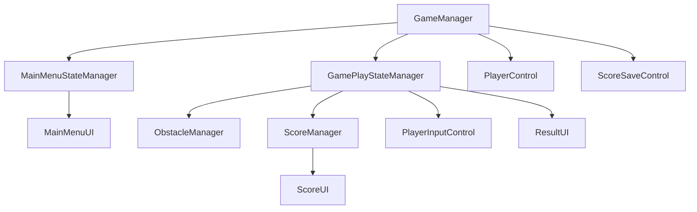
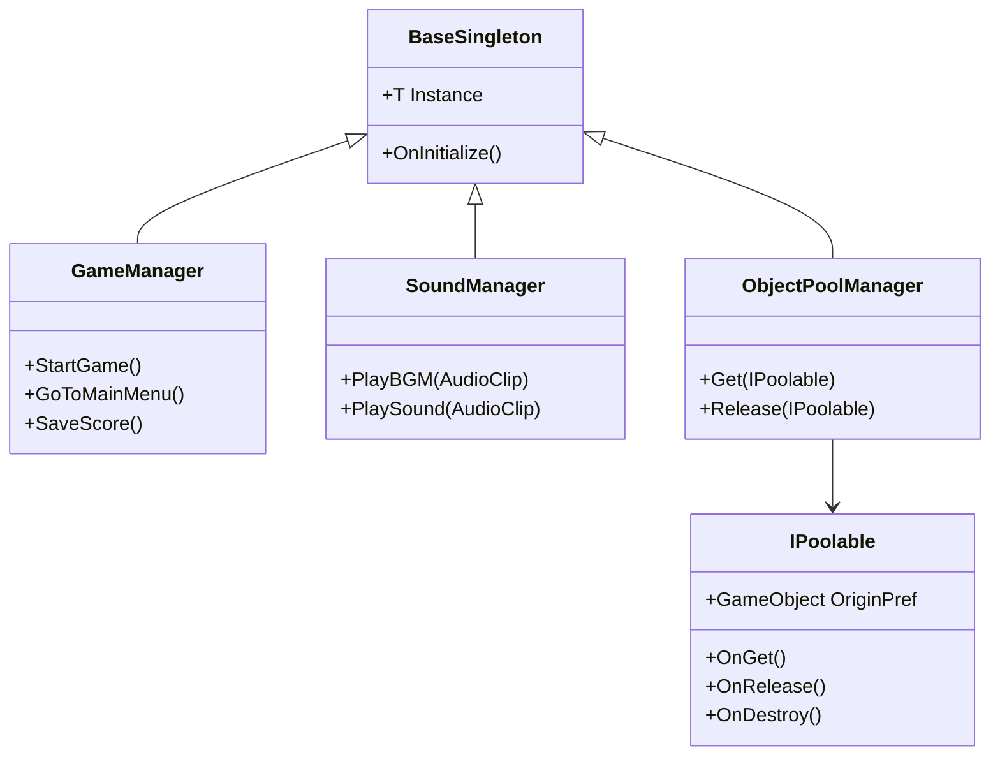
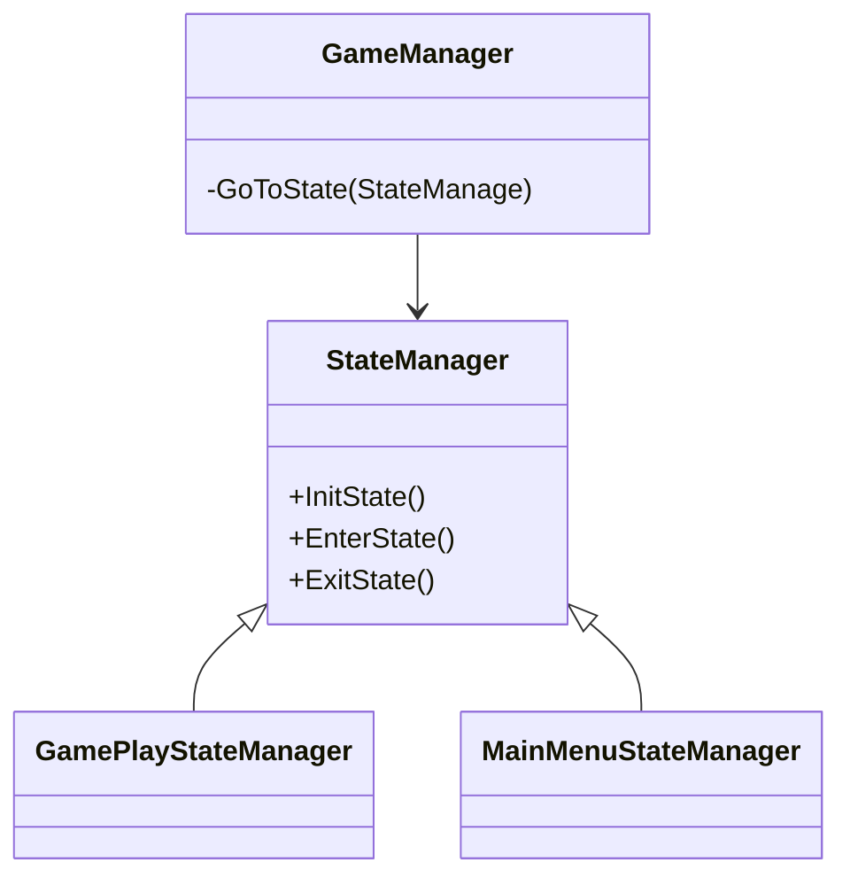

## Technical decisions
## Core Structure

This Diagram show how each class Relate to each other,class below will be controled by above class
##  Sigleton

- I decided to implement a base Singleton class to simplify the creation of singleton-behavior managers across the game. The main managers that use this pattern are:
    - GameManager → Controls overall game flow and sections (state management).
    - SoundManager → Handles background music, SFX, and volume settings.
    - ObjectPoolManager → Manages reusable objects through pooling, avoiding costly Instantiate/Destroy operations.
- Pros
    - Using Sigleton make it s easly to control and acess variable.
- Cons
    - need to understart what class should be or shouldn't be sigleton, and need to careful with memory leak and initalize sequnce if not manager properly.
### SoundManager
- SoundManager uses object pooling to manage AudioSource components
- Pros
    - preventing excessive and unmanageable instances. Any changes to sound behavior can be applied by modifying only the SoundManager
    - easy to play audio.
- Cons
    - need to understart how to use SoundManeger properly
### ObjectPoolManager
- I modify UnityObjectPool,to be more friendly to use with IPoolable interface and sigleton.
- ObjectPoolManager Manages reusable objects through pooling, avoiding costly Instantiate/Destroy operations.
- Pros
    - ObjectPoolManager improves performance by reducing Instantiate/Destroy calls.
    - Don't need to manage core logic of Pooling system
- Cons
    - performance are base on Unity Engine.
## State Manager 

- This Game will run base on states ,controled by Gamaneger.
- each state are in-dependencies with each orther.
- each state will create object,UI, etc for it own once enter the state.
- Pros
    - preventing loading assets on start game, provide faster start-up game
    - can be improve futhermore using addressable 
    - easy to scope state behaveiver
    - easy to add or remove states in-game
- Cons
    - If the previous state is not managed properly, it may cause bugs in subsequent states.
-Alternative
    - using scene base(by game loop one scene is enogh for this game)
 ## Saving Methods
 save by using Playerpref
- Pros
    - easy to implement
- Cons
    - hard to manage large and complicate save data
## Object animation and Movement
 - Using Primetween
- Pros
    - easy to implement
    - primetween ate versatile and can be use for wide range of motion
- Cons
    - need to understand tween behavier.

  
 

