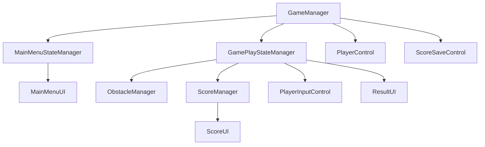
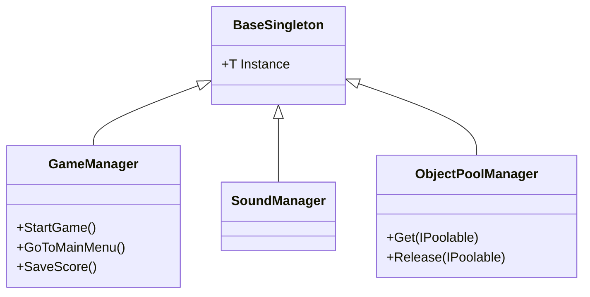

## Technical decisions
## Core Structure

This Diagram show how each class Relate to each other,class below will be controled by above class
##  Sigleton

I decided to implement a base Singleton class to simplify the creation of singleton-behavior managers across the game. The main managers that use this pattern are:
- GameManager → Controls overall game flow and sections (state management).
- SoundManager → Handles background music, SFX, and volume settings.
- ObjectPoolManager → Manages reusable objects through pooling, avoiding costly Instantiate/Destroy operations.
