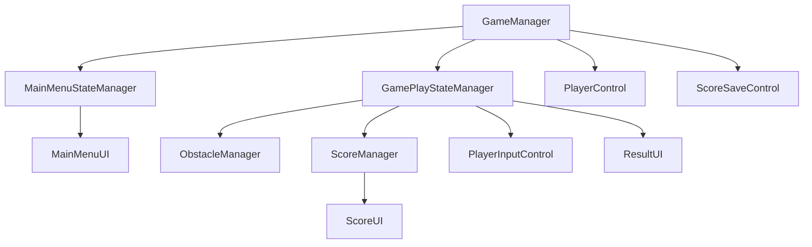
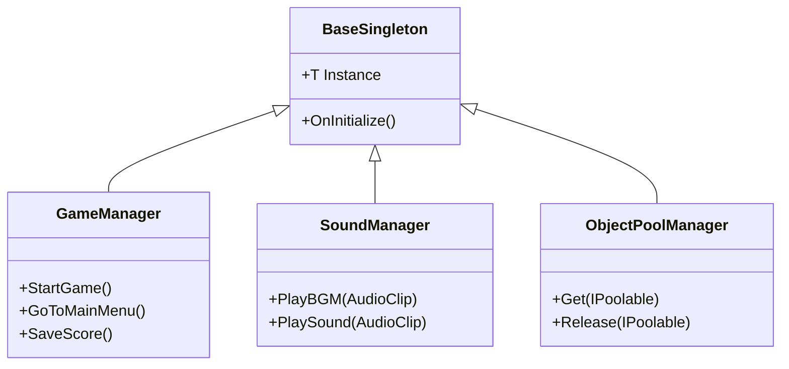
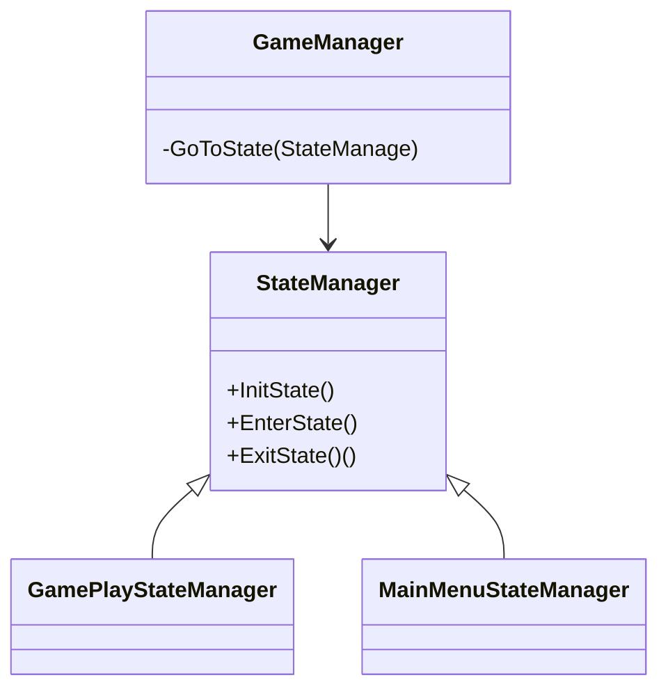

## Technical decisions
## Core Structure

This Diagram show how each class Relate to each other,class below will be controled by above class
##  Sigleton

- I decided to implement a base Singleton class to simplify the creation of singleton-behavior managers across the game. The main managers that use this pattern are:
    - GameManager → Controls overall game flow and sections (state management).
    - SoundManager → Handles background music, SFX, and volume settings.
    - ObjectPoolManager → Manages reusable objects through pooling, avoiding costly Instantiate/Destroy operations.
- Pros
    - Using Sigleton make it s easly to control and acess variable.
- Cons
    - need to understart what class should be or shouldn't be sigleton, and need to careful with memory leak and initalize sequnce if not manager properly.
## SoundManager
## ObjectPoolManager
## State Manager 

